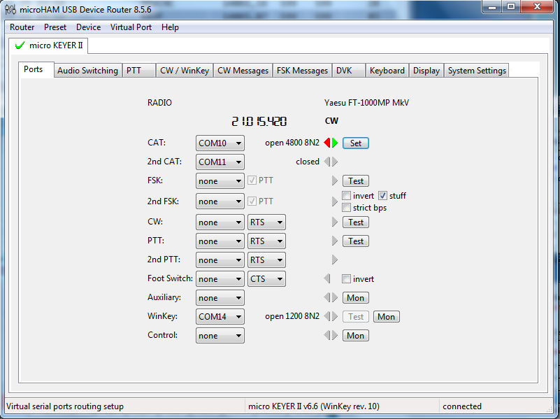

# MicroHAM-MK2
MicroHAM Micro Keyer MK2 Settings for the usage on DX Contest.

## Instalation
From the Router Tab,
* Open microHAM USB Device Router
* Click Restore Backup Settings (or anything which most resembles that)
* Choose the "CQWW - CW - Settings.urs"
* then OK.

The settings shouldbe loaded successfully.

## Example of the Settings

...
Handiko - 2018
